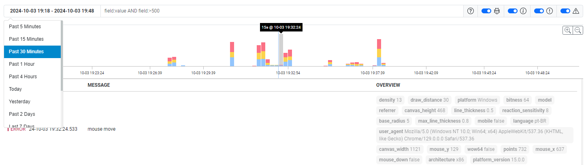

<br>
<div align="center">
    
    <p align="center">
        <strong>SQLog</strong> - Connecting the dots
    </p>    
</div>

**SQLog** is a **Golang** library that leverages the power of **slog** to streamline log management in a simple and efficient way. 

One of its key advantages is its integration with **SQLite**, an embedded database, meaning there's no need for an external database server setup. This reduces operational costs and drastically simplifies system maintenance, as everything runs **embedded**, without complex dependencies.

With **SQLog**, you get a lightweight and robust solution for securely logging and storing data. It's ideal for developers looking for a practical, cost-effective, and reliable way to monitor their applications, without sacrificing performance.

## Requirements

The builtin SQLite storage uses the package `github.com/mattn/go-sqlite3`, which is a cgo package, so you need `gcc`.

See the link for more details: [https://github.com/mattn/go-sqlite3?tab=readme-ov-file#installation](https://github.com/mattn/go-sqlite3?tab=readme-ov-file#installation)

## Usage

Below is an example of using **SQLog** with the SQLite storage, with the interface exposed on port `8080`. When you access `http://localhost:8080?msg=test`, any query parameter will be sent to the log.

You can view the generated logs at `http://localhost:8080/logs/`.

> **Demo** You can see a [complete example in the demo directory](./demo/).

```go
import (
	"log/slog"
	"net/http"
	"os"
	"strings"

	"github.com/nidorx/sqlog"
	"github.com/nidorx/sqlog/sqlite"
)

func main() {
	storage, _ := sqlite.New(nil)
	logger, _ := sqlog.New(&sqlog.Config{
		Storage: storage,
	})

	// magic
	slog.SetDefault(slog.New(logger.Handler()))

	if true {
		// In the local environment, you can send the log to standard output.
		logger.Fanout(slog.NewTextHandler(os.Stdout, nil))
	}

	// SQLog ui/api handler
	logHttpHandler := logger.HttpHandler()

	// http handler (... nidorx/chain, gin-gonic/gin, gorilla/mux, julienschmidt/httprouter)
	httpHandler := http.HandlerFunc(func(w http.ResponseWriter, r *http.Request) {
		if idx := strings.LastIndex(r.URL.Path, "/logs"); idx >= 0 {
			logHttpHandler.ServeHTTP(w, r)
		} else {
			args := []any{}
			msg := "I ❤️ SQLog"
			for k, v := range r.URL.Query() {
				if k == "msg" {
					msg = strings.Join(v, ",")
				} else {
					args = append(args, slog.Any(k, strings.Join(v, ",")))
				}
			}

			slog.Log(r.Context(), slog.LevelInfo, msg, args...)
			w.Write([]byte("🫶"))
		}
	})

	http.ListenAndServe(":8080", httpHandler)
}
```

## Demo

[SQLog-demo.webm](https://github.com/user-attachments/assets/046b65c9-dd36-4779-8b15-915be5f7e3f3)

There is a test project in the [demo directory](./demo/).

The demo project captures all mouse movements and sends them to the server, which logs the received parameters.

You can also view the current version of the SQLog demo at the links below:

- Log generator (see console): https://sqlog-demo.onrender.com/
- **SQLog** UI: https://sqlog-demo.onrender.com/logs/


<div align="center">
    
</div>


> **IMPORTANT**! I am using the [free version of Render](https://docs.render.com/free), so there is no guarantee of service stability or availability.


## How it works

<div align="center">
    
</div>

**SQLog** is an efficient library for capturing and managing logs, designed with a focus on performance and low latency. The architecture of the solution consists of four main components: **Handler**, **Ingester**, **Chunk**, and **Storage**. Each of these components plays a crucial role in the ingestion, storage, and retrieval of logs.

1. **Handler**

    The **Handler** is an implementation of `slog.Handler`, allowing **SQLog** to be easily integrated as the standard logger in Go. It transforms logs coming from `slog` into JSON format using the default encoder `slog.NewJSONHandler` or a custom encoder, providing flexibility in log formatting.

2. **Ingester**

    The **Ingester** manages the ingestion of logs from the **Handler** in a non-blocking manner. It maintains an in-memory buffer that stores log entries in blocks called **Chunks**. When a **Chunk** reaches its maximum capacity, the Ingester starts using the next **Chunk**, marking the current one for writing to **Storage**. At regular intervals, the Ingester invokes the `Flush` method of the **Storage** to persist filled **Chunks**.

    > **Performance**: One notable feature of the Ingester is its non-blocking implementation, which avoids using mutexes to ensure concurrency. Instead, it utilizes atomic operations from Go (`sync/atomic`), allowing multiple goroutines to write logs simultaneously without waiting on each other, resulting in superior performance and reduced latency.

3. **Chunk**

    The **Chunk** is a non-blocking structure that allows continuous writing of log entries. Each **Chunk** is a node in a linked list that has a reference to the next **Chunk**. The Ingester maintains references to two nodes: the current **Chunk**, which is still accepting new entries, and the flush **Chunk**, which contains completed entries that have not yet been persisted.

    > **Data Structure**: This linked list approach not only simplifies the management of **Chunks** but also facilitates fast, non-blocking writing. By updating the internal references during the flush process, the Ingester ensures that logs are written efficiently with minimal performance impact.

4. **Storage**

    The **Storage** is responsible for the persistence of logs. **SQLog**'s modular architecture allows for the implementation of different types of storage, such as disk files, databases, and external systems. Currently, there is a [native implementation for SQLite (see more details)](./sqlite) and another in development for in-memory persistence.

    **Responsibilities**:
    - **Persistence**: The Storage receives and stores **Chunks** from the Ingester.
    - **Search**: It also allows for the retrieval of records, which is used by the **SQLog** API for log visualization.

The combination of these layers makes **SQLog** a robust and efficient solution for log management, optimizing performance through a non-blocking architecture and the use of atomic operations. This results in fast, real-time log capture capable of handling high workloads without compromising efficiency.


## @TODO/IDEAS/ROADMAP

If you would like to contribute to this project, here are some tasks and ideas listed below. Feel free to suggest and implement new features in **SQLog**.

If you decide to work on a task, please leave a comment on the Issue so that others can collaborate.

- **[InMemory Storage](https://github.com/nidorx/sqlog/issues/4)**
- **[Alerts](https://github.com/nidorx/sqlog/issues/2)** -  Enable the creation of alerts within SQLog. The solution should leverage the syntax of the language to evaluate logs at regular intervals and trigger alerts when specific conditions are met.
- [Metrics (Count, AVG, Dashboards)](https://github.com/nidorx/sqlog/issues/3)
- NOT, REGEX (https://www.sqlite.org/lang_expr.html)


All kinds of contributions are welcome!

🐛 **Found a bug?**  
Let me know by [creating an issue][new-issue].

## References

- This project was inspired by [Blacklite](https://github.com/tersesystems/blacklite)
- https://github.com/IGLOU-EU/go-wildcard
- The interface is inspired by [Datadog](https://www.datadoghq.com/)


[bugs]: https://github.com/nidorx/sqlog/issues?q=is%3Aissue+is%3Aopen+label%3Abug
[features]: https://github.com/nidorx/sqlog/issues?q=is%3Aissue+is%3Aopen+label%3Afeature
[new-issue]: https://github.com/nidorx/sqlog/issues/new/choose
[discussions]: https://github.com/go-path/di/discussions

## License

This code is distributed under the terms and conditions of the [MIT license](LICENSE).
