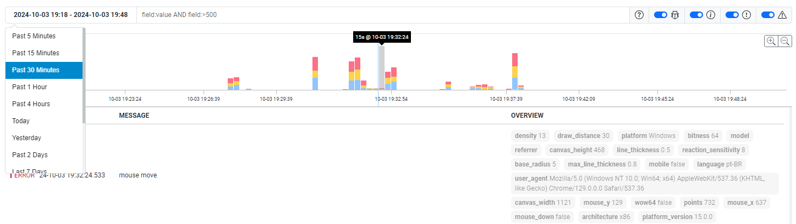

# SQLog Demo


You can view the current version of the SQLog demo at the links below:

The demo project captures all mouse movements and sends them to the server, which logs the received parameters.

- **Log generator**: https://sqlog-demo.onrender.com/
- **SQLog UI** : https://sqlog-demo.onrender.com/logs/

    > **IMPORTANT**! I am using the [free version of Render](https://docs.render.com/free), so there is no guarantee of service stability or availability.

[SQLog-demo.webm](https://github.com/user-attachments/assets/046b65c9-dd36-4779-8b15-915be5f7e3f3)


<div align="center">
    
</div>


## Build Docker

```
docker build --build-arg PROJECT_VERSION=1.0.0 -t nidorx/sqlog-demo:latest .

# run
docker run -p 8080:8080 nidorx/sqlog-demo:latest

# publish
docker images nidorx/sqlog-demo
docker tag stacksimplify/mynginx_image1:v1 stacksimplify/mynginx_image1:v1-release
docker push nidorx/sqlog-demo:latest
```